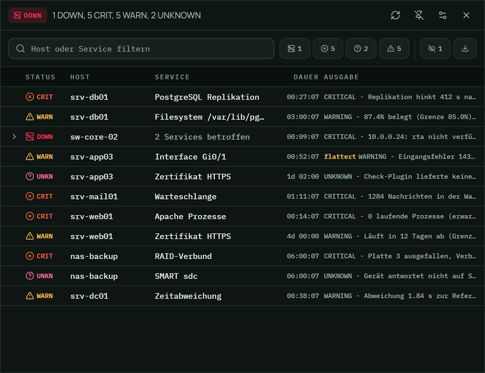
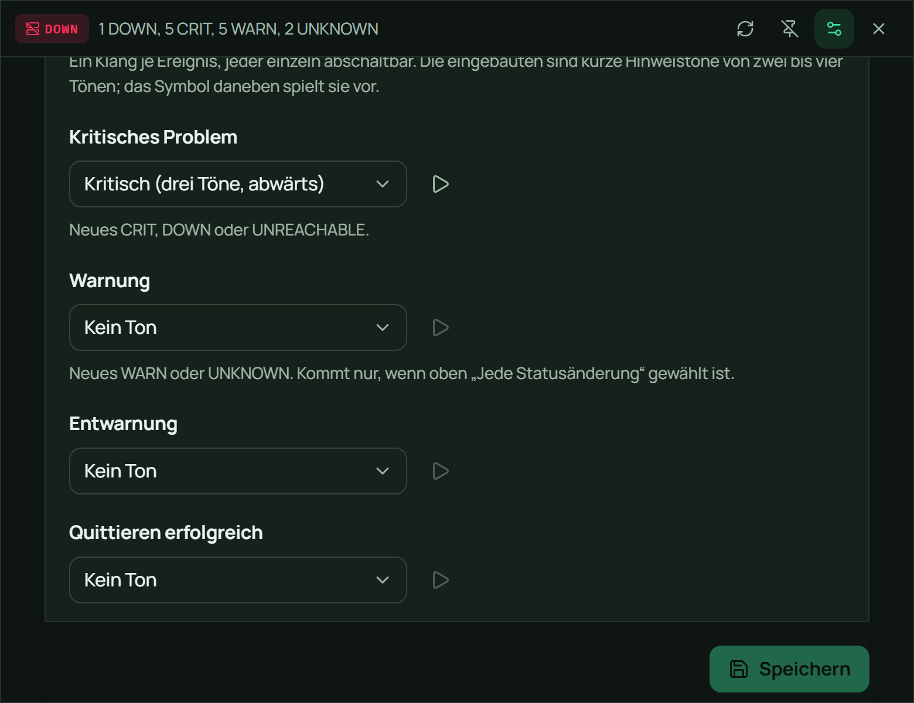

<p align="center">
  
</p>

# Luchsr

**CheckMK-Statusmeldungen im Windows-Infobereich.** Ein Tray-Icon zeigt die
schlimmste offene Meldung als Farbe; ein Klick öffnet die Problemliste, ohne den
Browser zu bemühen.

Bewusst **nur** CheckMK, kein Multi-Backend. Die Beschränkung ist Absicht: sie
hält das Werkzeug klein und die Fehlermeldungen konkret. Zielplattform ist
ausschliesslich **Windows 11 x64** — es gibt keinen Cross-Platform-Code, und die
plattformnahen Wege (Credential Manager, Schannel, Infobereich) sind direkt
genutzt statt abstrahiert.

Eine eigenständige Neuentwicklung unter der **MIT-Lizenz** (siehe `LICENSE`); es
ist keine Zeile fremden Quelltexts übernommen.

> **Entstanden mit KI.** Entwürfe, Quelltext und Tests sind im Dialog mit
> Claude (Anthropic) entstanden. Auftrag, Entscheidungen und Prüfung liegen
> beim Autor. `CLAUDE.md` führt das vollständige Entscheidungslog — einschliesslich
> der Stellen, an denen sich eine frühere Entscheidung als falsch erwies.

## Herunterladen

Fertige Pakete liegen unter [Releases](../../releases): die **MSI** ist das
Hauptziel, das NSIS-Paket der Rückfall. Beide sind derzeit **nicht
codesigniert** — Windows zeigt beim interaktiven Installieren einen
SmartScreen-Hinweis.

## Was es tut

* Ein Tray-Icon, das die schlimmste offene Meldung als Farbe zeigt — sechs
  Zustände, bei 16 px unterscheidbar.
* Ein rahmenloses Popup am Infobereich mit der Problemliste, virtualisiert und
  brauchbar bei 80 gleichzeitigen Problemen. Ist ein **Host selbst ausgefallen**,
  klappen seine Dienste unter ihm zusammen — ihre Meldungen sind dann Folge und
  nicht eigener Befund.
* Filter nach Freitext und Statusklasse, Detailansicht mit vollständiger
  `plugin_output`.
* **Quittieren** und **Wartungszeit setzen**, beides einzeln freizugeben und
  standardmässig aus.
* Windows-Benachrichtigungen bei Statusänderungen — mit Luchsr als Absender und
  einem Zustandslogo in der Farbe des Tray-Icons, dazu kurze Hinweistöne: ein
  Klang je Ereignis, jeder abschaltbar.
* CSV-Export der vollständigen Liste.
* Ein Knopf in den Einstellungen sagt, ob es eine neuere Fassung gibt —
  gefragt wird nur auf Klick, installiert wird nicht automatisch.

Nicht Teil des Projekts: andere Monitoring-Backends, Konfigurationsänderungen an
CheckMK, Graphen und Historie, mehrere Instanzen gleichzeitig, Auto-Update.

### Die sechs Zustände

Das sind die ausgelieferten Icons, nicht Nachbildungen — dieselben Dateien, die
im Infobereich landen.

| Icon | Zustand | Bedeutung |
|:---:|---|---|
|  | **DOWN** | Der Host antwortet nicht. Schlägt alles andere: ist der Host weg, ist jede Aussage über seine Dienste wertlos. |
|  | **CRIT** | Ein Dienst ist kaputt. |
|  | **UNKNOWN** | Der Check selbst funktioniert nicht — ein anderer Fehlertyp als ein kaputter Dienst, und ein weniger dringender. |
|  | **WARN** | Ein Schwellwert ist überschritten. |
|  | **OK** | Nichts offen. Quittierte Probleme und geplante Wartung zählen dazu. |
|  | **Getrennt** | Der Server antwortet nicht. **Nie grün** — ein grünes Icon, während der Server nicht erreichbar ist, sieht aus wie „alles in Ordnung" und ist die schlimmste Fehlinformation, die dieses Programm liefern kann. |

Die Farbtöne liegen mindestens 16° auseinander, weil bei einer 16-px-Fläche
allein der Farbton entscheidet und nicht die Helligkeit. In der Liste und in den
Benachrichtigungen kommt zu jeder Farbe ein Symbol und ein Kürzel: Status wird
nie allein über Farbe kodiert.

### So sieht es aus



Das Popup in seiner echten Grösse, 780 × 600. `sw-core-02` ist selbst
ausgefallen, seine beiden Dienste sind unter ihm zusammengeklappt. Der
durchgestrichene Augen-Knopf rechts zeigt an, dass ein bearbeitetes Problem
ausgeblendet ist — quittierte und geplante verschwinden nicht, sie stehen nur
nicht im Weg.



Ein Klang je Ereignis, jeder abschaltbar; das Dreieck spielt ihn vor. Steht ein
Ereignis auf „Kein Ton", ist das Dreieck ausgegraut — ein Knopf, der stumm
nichts tut, liest sich sonst wie ein Fehler.

> Die Bilder zeigen die **echte Oberfläche** mit erfundenen Daten: gerendert
> wurde die ausgelieferte Anwendung, nur die Antworten des Backends waren
> vorbereitet. Hosts und Meldungen sind erdacht, keine reale Umgebung.

## Installation

MSI aus den [Releases](../../releases) laden, oder nach einem eigenen Build aus
`src-tauri/target/release/bundle/msi/`.

```bash
msiexec /i Luchsr_1.2.0_x64_de-DE.msi /qn
```

Installiert **per Machine** nach `%ProgramFiles%\Luchsr`. Die Upgrade-GUID ist
fest, ein Update läuft also in-place; ein Downgrade wird abgelehnt.

`/qn` braucht einen **erhöhten Kontext**: eine Per-Machine-Installation bricht
als normaler Benutzer mit `1925 / 1603` ab. Über Softwaremanagement läuft es als
SYSTEM und damit problemlos; interaktiv kommt eine UAC-Abfrage.

Zum Signieren siehe unten.

### Voraussetzungen auf dem Zielrechner

* Windows 11 x64
* **WebView2-Runtime.** Auf Windows 11 vorinstalliert. Fehlt sie, startet das
  Fenster nicht.
* Kein .NET, kein Visual-C++-Redistributable.

## Einrichten

Beim ersten Start erscheint der Einrichtungsassistent. Gebraucht werden:

| Feld | Beispiel |
|---|---|
| Server-URL | `https://checkmk.example.intern` — **ohne** Pfad |
| Site | `meinesite` |
| Benutzername | das Konto, zu dem das Automation-Secret gehört |
| Automation-Secret | in CheckMK unter „Benutzer" beim jeweiligen Konto |

Das Secret ist **nicht** das Anmeldekennwort. Es liegt ausschliesslich im
Windows Credential Manager unter dem Dienst `leosysr.Luchsr` — nie in einer
Datei, nie in einem Protokoll.

„Verbindung testen" nennt im Fehlerfall die tatsächliche Ursache: DNS, TLS-Kette,
401, 403, 404 samt der Begründung des Servers.

### Vorbelegung für die Massenverteilung

Liegt beim ersten Start `%ProgramData%\leosysr\Luchsr\defaults.json`, werden
daraus Vorgabewerte übernommen — typisch Server und Site. Der Benutzer kann sie
danach überschreiben. Vorlage: `packaging/defaults.example.json`.

Das Automation-Secret gehört **nicht** in diese Datei und wird dort auch nicht
gelesen.

## Wo Luchsr etwas ablegt

| Zweck | Ort |
|---|---|
| Einstellungen | `%APPDATA%\leosysr\Luchsr\config.json` |
| Maschinenvorgaben | `%ProgramData%\leosysr\Luchsr\defaults.json` |
| Automation-Secret | Credential Manager, Dienst `leosysr.Luchsr` |
| Protokoll | `%LOCALAPPDATA%\de.leosysr.luchsr\logs\luchsr.log` |
| Autostart | `HKCU\…\CurrentVersion\Run`, Wert `Luchsr` |

Eine beschädigte `config.json` wird nach `config.json.beschaedigt-N` zur Seite
gelegt; Luchsr startet dann mit Vorgaben und weist im Dialog darauf hin.

## Wenn etwas nicht geht

**Zuerst ins Protokoll.** In PowerShell:

```bash
Get-Content "$env:LOCALAPPDATA\de.leosysr.luchsr\logs\luchsr.log" -Tail 40 -Encoding utf8
```

`-Encoding utf8` ist nötig: die Datei ist UTF-8, Windows PowerShell 5.1 liest
sonst die ANSI-Codepage und macht aus „nächster Abruf" ein „nächster Abruf".

**Verbindungsprobleme unabhängig von Luchsr prüfen** — `scripts/checkmk-probe.ps1`
sendet genau die Anfragen, die Luchsr sendet, und zeigt Statuscode, `Content-Type`
und Rumpf. Das Secret wird verborgen abgefragt und landet nicht in der Historie.

Die Unterscheidung, die am meisten Zeit spart:

| Antwort | Herkunft |
|---|---|
| `application/problem+json` mit `detail` | von CheckMK |
| `text/html`, kein `Server`-Header | von einem Proxy oder Apache davor |

**Proxy.** Luchsr liest die Proxy-Einstellung aus den Umgebungsvariablen
(`HTTP_PROXY`, `HTTPS_PROXY`, `NO_PROXY`), Browser und PowerShell dagegen aus
WinINET. In Firmennetzen laufen diese Quellen auseinander: dann erreicht der
Browser den internen Server direkt, Luchsr schickt an den Proxy und bekommt
`403 Forbidden` mit HTML — das sieht wie ein Berechtigungsproblem in CheckMK
aus und ist keins. Luchsr **warnt** in diesem Fall im Einstellungsdialog; die
Abhilfe ist „Proxy: Keiner".

**TLS gegen eine interne CA.** Luchsr nutzt den Windows-Zertifikatspeicher. Der
saubere Weg ist, das Stammzertifikat der internen CA dort aufzunehmen. Die
TLS-Prüfung abzuschalten ist möglich, aber eine Notlösung — der Dialog warnt
deutlich.

**„Nach Updates suchen" scheitert.** Der Knopf fragt `api.github.com`, also einen
Host im Internet — im Firmennetz führt der Weg dorthin womöglich über einen
Proxy, den Luchsr nicht kennt. Anders als beim CheckMK-Server nutzt der
Update-Check **immer** den Systemproxy aus den Umgebungsvariablen: für ein Ziel
im Internet ist das die richtige Quelle. Die Meldung nennt die Ursache; ein
Fehlschlag hier wirkt sich auf nichts anderes aus. Die Einstellung „TLS-Prüfung
aus" gilt der internen CA und schlägt hier **nicht** durch — gegen GitHub wird
immer geprüft.

Kommt „Das Anfragelimit von GitHub ist erreicht": unangemeldet sind es 60
Anfragen je Stunde und IP-Adresse, geteilt mit allen Rechnern hinter derselben
Adresse. Nach einer Stunde geht es wieder.

**Kein Hinweiston.** Er kann nur WAV. Eine MP3 ergibt keinen Fehler, sondern
Stille; die Einstellungsprüfung warnt in diesem Fall. Ausserdem klingt je Runde
nur **ein** Ton, und nur für die dringlichste Stufe — steht die auf „kein Ton",
bleibt es still.

## Aus dem Quelltext bauen

```bash
npm install
npm run tauri build
```

Voraussetzungen: Rust `stable-x86_64-pc-windows-msvc`, VS Build Tools mit
C++-Workload, Node.js LTS, WebView2-Runtime.

### Ein Release veröffentlichen

`.github/workflows/release.yml` baut auf einem frischen Windows-Läufer und hängt
MSI, NSIS-Paket und `SHA256SUMS.txt` an ein Release. Ausgelöst wird es durch
einen Tag:

```bash
git tag v1.2.0
git push origin v1.2.0
```

Der Tag muss zur `version` in `src-tauri/tauri.conf.json` passen — der Workflow
bricht sonst ab, bevor er baut. Sonst entstünde ein Release, dessen Dateiname
und Produktversion etwas anderes sagen als der Tag.

Ein manueller Lauf über „Run workflow" baut ebenfalls, legt aber **kein** Release
an: die Pakete hängen dann als Artefakt am Lauf. So füllt sich die Release-Liste
nicht mit Testbauten.

### Prüfen

```bash
npm run typecheck
npm test
cargo test --lib --manifest-path src-tauri/Cargo.toml
cargo clippy --manifest-path src-tauri/Cargo.toml --lib --all-targets -- -D warnings
```

Es gibt keine Tests, die einen CheckMK-Server brauchen: alles Auswertende liegt
in reinen Funktionen und läuft gegen aufgezeichnete API-Antworten in
`src-tauri/src/checkmk/fixtures/`.

Der Nachweis, dass TLS über den Windows-Zertifikatspeicher läuft:

```bash
cargo tree --manifest-path src-tauri/Cargo.toml --invert schannel --edges normal --target x86_64-pc-windows-msvc
```

Die Kette muss `schannel ← native-tls ← reqwest ← luchsr` zeigen. Die
Gegenprobe mit `--invert rustls` muss „nothing to print" ergeben.

### Erzeugte Dateien

Vier Dinge im Baum werden erzeugt und **nicht von Hand bearbeitet**:

```bash
node scripts/make-icons.mjs      # Icons und README-Banner aus scripts/mark.mjs
node scripts/make-sounds.mjs     # Hinweistöne nach src-tauri/sounds/
pwsh -File scripts/third-party.ps1   # THIRD-PARTY.md aus den Abhängigkeiten
```

Die Bilder der Oberfläche brauchen einen laufenden Dev-Server, deshalb zwei
Schritte:

```bash
npm run dev
```

```bash
pwsh -File scripts/screenshots.ps1
```

Aufgenommen wird die **echte Anwendung** — `src/dev/mockup.tsx` rendert `App`
und fälscht nur die Antworten des Backends. Ein nachgemaltes Bild wäre eine
zweite Wahrheit, die beim nächsten Umbau falsch wird, ohne dass es jemand
merkt: ein Bild kompiliert nicht. Die Beispieldaten sind getypt, `npm run
typecheck` fängt eine Schemaänderung also mit.

`mockup.html` landet **nicht** im Auslieferungsbau: Vites Vorgabe für `build`
ist allein `index.html`. Nachgeprüft an `dist/`, nicht angenommen.

### Codesignatur

`bundle.windows.certificateThumbprint` steht auf `null`, es wird unsigniert
gebaut. Zum Signieren den SHA1-Thumbprint eines Codesignaturzertifikats aus dem
Windows-Zertifikatspeicher eintragen:

```bash
Get-ChildItem Cert:\CurrentUser\My -CodeSigningCert | Format-List Subject, Thumbprint
```

Der Thumbprint gehört **nicht** in die Datei — er kommt als Umgebungsvariable
`TAURI_SIGNING_...` bzw. über eine lokale, nicht versionierte Konfiguration.
Der Zeitstempeldienst ist auf `timestamp.digicert.com` gesetzt und funktioniert
auch mit einem intern ausgestellten Zertifikat.

## Lizenzen

Luchsr steht unter MIT (`LICENSE`). Was mitgeliefert wird und unter welcher
Lizenz, steht in `THIRD-PARTY.md`; die Volltexte liegen unter `licenses/` und
werden mit dem Paket installiert.

Erwähnenswert: die Schriften **Manrope** und **IBM Plex Mono** sind lokal
eingebettet (kein Laufzeit-Netzzugriff) und stehen unter der SIL Open Font
License 1.1, die verlangt, dass ihr Text jede Kopie begleitet. Fünf Crates aus
dem Tauri-Unterbau stehen unter MPL-2.0 — das ist mit MIT vereinbar, die MPL
wirkt dateiweise und erlaubt das „Larger Work" ausdrücklich.

## Für Entwickler

`CLAUDE.md` ist der Einstiegspunkt: Aufbau, Designregeln und ein
Entscheidungslog mit der Begründung jeder nicht offensichtlichen Wahl. Wer hier
etwas ändert, sollte es gelesen haben — vor allem die Token-Regel
(`src/styles/tokens.css` ist die einzige Stelle mit konkreten Design-Werten)
und die Aufteilung in reine Funktionen.
